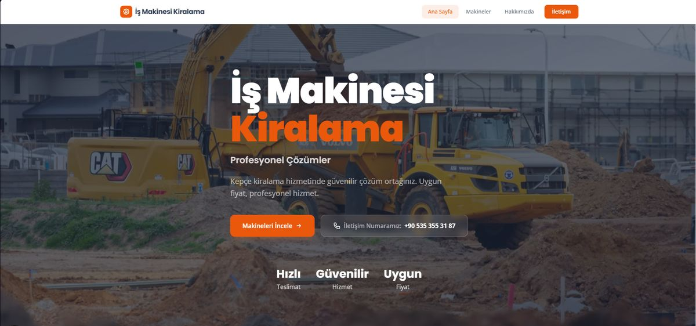

# 🏗️ İş Makinesi Kiralama Platformu

İnşaat ve hafriyat sektörü için **beko loder, ekskavatör ve mini ekskavatör** kiralama hizmeti sunan modern, hızlı ve SEO-odaklı bir web sitesi.



## 🚀 Teknolojiler

- **Next.js 16** (Pages Router) — React framework
- **Tailwind CSS v4** — utility-first stiller
- **Formspree** — form gönderimleri (ücretsiz, sunucusuz)

## ✨ Özellikler

- Responsive / mobil uyumlu tasarım
- Makine kategorileri: Beko Loder, Ekskavatör, Mini Ekskavatör
- Makine seçimi → iletişim formuna otomatik makine bilgisi taşıma
- Formspree ile çalışan iletişim formu (başarı / hata durumları)
- SEO: her sayfada unique `title` / `description`, Open Graph, JSON-LD (`RentalService`)
- `next/image` ile optimize edilmiş görseller

## 📁 Proje Yapısı

```
is-makinesi-kiralama/
├── pages/               # Sayfalar (Pages Router)
│   ├── index.js         # Ana sayfa
│   ├── makineler.js     # Makine kategorileri
│   ├── makineler/       # Kategori detayları (beko-loder, ekskavator, mini-ekskavator)
│   ├── hakkimizda.js
│   └── iletisim.js      # İletişim + form
├── components/          # Layout, Header, Hero, Footer, MachineCard, MachineGrid, ContactForm
├── public/              # Statik dosyalar (görseller, robots.txt, sitemap.xml)
├── styles/globals.css   # Tailwind CSS + tema
├── docs/                # README görselleri
├── next.config.mjs
└── package.json
```

## 🛠️ Kurulum

```bash
npm install
npm run dev      # Geliştirme sunucusu (localhost:3000)
npm run build    # Production build
npm run start    # Production sunucu
npm run lint     # ESLint ile kod kontrolü
```

## 🔑 İletişim Formu (Formspree)

Form gönderimleri Formspree üzerinden sağlanır. Form ID'si `components/ContactForm.js` içinde güncellenir. Bir makine seçilip iletişim sayfasına gelindiğinde seçilen makine bilgisi forma otomatik olarak taşınır.

## 🌐 Deployment (Vercel)

- Vercel'de yeni proje oluşturup bu repoyu bağlayın.
- Deploy otomatik olarak gerçekleşir.
- Production branch'e her push sonrası yeni build alınır.

## ✅ Yapılacaklar

- Gerçek domain bağlama (`robots.txt` / `sitemap.xml` güncellemesi)
- Gerçek makine fotoğrafları
- `og:image` eklenmesi (sosyal paylaşım önizlemeleri)
- Ana sayfa ekran görüntüsünün güncellenmesi
