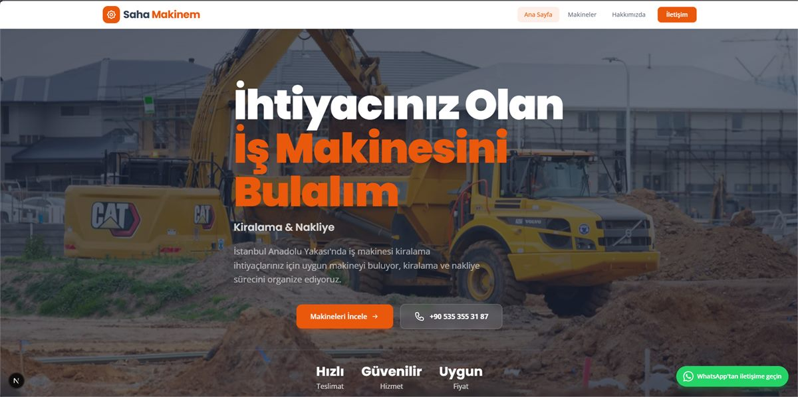

# 🏗️ Saha Makinem — İş Makinesi Kiralama

İnşaat ve hafriyat sektörü için **beko loder, ekskavatör ve mini ekskavatör** kiralama hizmeti veren, SEO-odaklı ve yüksek performanslı bir web sitesi. **İstanbul Anadolu Yakası**'nda hizmet verir.




## 📖 İçindekiler

- [Teknolojiler](#-teknolojiler)
- [Özellikler](#-özellikler)
- [SEO](#-seo)
- [Proje Yapısı](#-proje-yapısı)
- [Kurulum](#-kurulum)
- [İletişim Formu (Formspree)](#-iletişim-formu-formspree)
- [Deployment (Vercel)](#-deployment-vercel)

## 🚀 Teknolojiler

| Teknoloji | Açıklama |
|---|---|
| **Next.js 16** (Pages Router) | SSR/SSG, dosya tabanlı routing, built-in `next/image` optimizasyonu |
| **React 19** | UI kütüphanesi |
| **Tailwind CSS v4** | Utility-first, CSS-first konfigürasyon (`@theme`), JavaScript yapılandırması gerektirmez |
| **next/font** | Google Fonts'u (Poppins + Open Sans) self-host ederek render-blocking harici isteği sıfırlar |
| **Formspree** | Sunucusuz form gönderimi (ekstra backend gerektirmez) |
| **Vercel** | Ücretsiz hosting, otomatik deploy, edge network |

## ✨ Özellikler

- **3 makine kategorisi:** Beko Loder, Ekskavatör, Mini Ekskavatör — her biri için ayrı detay sayfası
- **Akıllı form:** Makine sayfasından iletişime geçildiğinde seçilen makine bilgisi forma otomatik taşınır
- **Kapsamlı SEO:** Sayfa bazlı `title`/`description`, Open Graph, canonical, **JSON-LD** yapılandırılmış veri
- **Kurumsal altyapı:** `Organization`, `WebSite`, `LocalBusiness`, `Service`, `BreadcrumbList`, `ItemList`, `AboutPage`, `ContactPage` şemaları
- **Yüksek performans:** Tüm sayfalar statik prerender (○ Static), self-hosted fontlar, optimize edilmiş görseller
- **Responsive tasarım:** Mobil / tablet / masaüstü uyumlu
- **Özel 404 sayfası:** Marka kimliğiyle uyumlu, ana sayfaya ve telefona yönlendiren hata sayfası

## 🔍 SEO

- her sayfada unique `title` + meta `description`
- `lib/site.js` merkezli sabitler (`SITE_URL`, `SITE_NAME`, `SITE_IMAGE`, ilçe listesi)
- Tüm sayfalarda `<link rel="canonical">`, `og:url`, `og:image`, `twitter:card`
- Global şemalar `pages/_app.js`'te; sayfa bazlı şemalar sayfa `<Head>` içinde
- `robots.txt` + `sitemap.xml` (sahamakinem.com) `public/` altında

## 📁 Proje Yapısı

```
is-makinesi-kiralama/
├── pages/                    # Sayfalar (Pages Router)
│   ├── index.js              # Ana sayfa
│   ├── makineler.js          # Makine kategorileri
│   ├── makineler/            # Kategori detayları (beko-loder, ekskavator, mini-ekskavator)
│   ├── hakkimizda.js         # Hakkımızda
│   ├── iletisim.js           # İletişim + form
│   ├── 404.js                # Özel 404 sayfası
│   └── _app.js / _document.js  # Global layout, fontlar, JSON-LD, meta
├── components/               # Layout, Header, Hero, Footer, ContactForm, MachinePageContent, icons
├── lib/                      # site.js (SEO sabitleri), fonts.js (next/font)
├── public/                   # Görseller, robots.txt, sitemap.xml
├── styles/globals.css        # Tailwind CSS v4 + tema tokenları
├── docs/                     # README görselleri
├── next.config.mjs
└── package.json
```

## 🛠️ Kurulum

```bash
npm install
npm run dev      # Geliştirme sunucusu (localhost:3000)
npm run build    # Production build
npm run start    # Production sunucu
npm run lint     # ESLint ile kod kontrolü
```

## 📬 İletişim Formu (Formspree)

Form gönderimleri Formspree üzerinden sağlanır. Form action'ı `components/ContactForm.js` içinde tutulur:

```
https://formspree.io/f/xxxxxxxx
```

Bir makine seçilip iletişim sayfasına gelindiğinde seçilen makine bilgisi forma otomatik taşınır.

## 🌐 Deployment (Vercel)

- Vercel'de proje oluşturup GitHub reposunu bağlayın
- Production branch'e her push'ta otomatik yeni build alınır
- Custom alan: `sahamakinem.com` (SSL otomatik, Vercel panelinden bağlanır)
- Vercel dashboard `Analytics` sekmesinden ziyaretçi istatistikleri açılabilir

## ⚠️ Canlıya Alırken Güncellenmesi Gerekenler

- [x] Formspree ID — `components/ContactForm.js`
- [x] Telefon +90 535 355 31 87 — `lib/site.js` ve bileşenler
- [x] `robots.txt` / `sitemap.xml` — `sahamakinem.com`
- [x] `og:image` — `public/images/hero.jpg`
- [ ] Gerçek makine fotoğrafları (`public/images/`)
- [ ] Google Search Console doğrulaması + `sitemap.xml` gönderimi